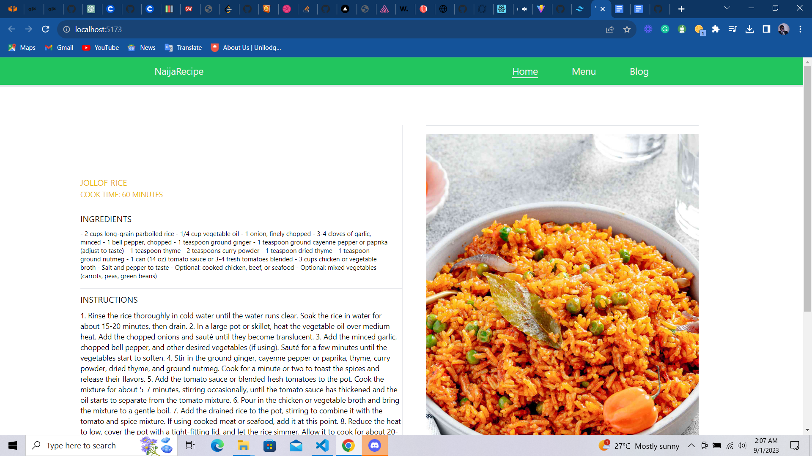

```
# Recipe App



## Description

This is a Recipe App built with React, Vite, and Tailwind CSS. It allows users to browse and search for various recipes, view their details, and try out delicious dishes.

## Features

- Browse a collection of diverse recipes.
- View detailed information about each recipe, including ingredients and instructions.
- Responsive design for seamless use on different devices.

## Installation

1. Clone this repository to your local machine:

```
git clone https://github.com/gabbyedgar/recipe-page.git
```

2. Navigate to the project directory:

```bash
cd recipe-app
```

3. Install the dependencies using your preferred package manager (npm or yarn):

```bash
npm install
# or
yarn install
```

4. Start the development server:

```bash
npm run dev
# or
yarn dev
```

5. Open your web browser and visit `http://localhost:5173/` to see the app in action.

## Technologies Used

- [React](https://reactjs.org/) - JavaScript library for building user interfaces.
- [Vite](https://vitejs.dev/) - Next-generation frontend build tool.
- [Tailwind CSS](https://tailwindcss.com/) - CSS framework for quickly building custom designs.

## Contributing

If you'd like to contribute to this project, feel free to open an issue or submit a pull request. Your input is greatly appreciated!

## License

This project is licensed under the [MIT License](LICENSE).

```
